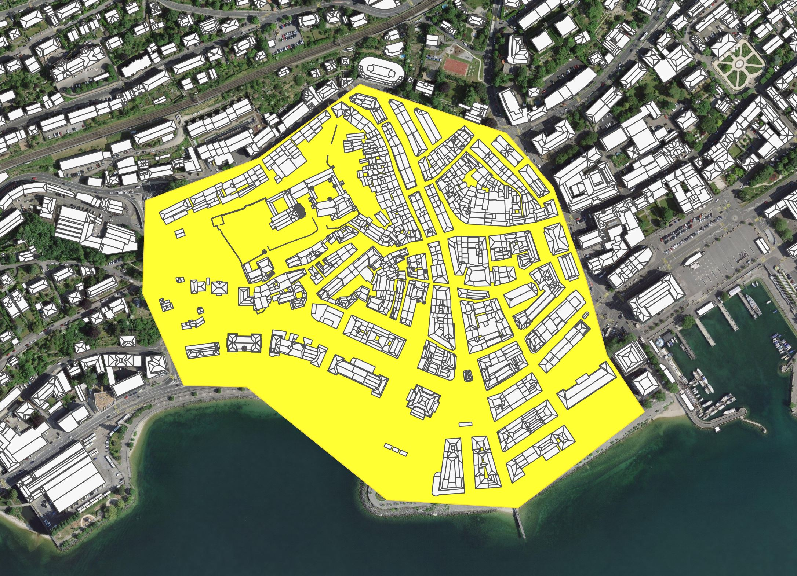

# Roof Segmentation and Superstructure Detection

This repository contains two main scripts:
1. **`create_dataset.py`**: Prepares the dataset by filtering roof geometries within a specified area of interest and downloading corresponding images from a Web Map Service (WMS).
2. **`script_predict.py`**: Loads the pre-trained segmentation model, generates predictions for roof superstructures, and calculates statistics on solar energy potential.

## Example Application: Neuchâtel Test Area
The image below shows an example of the selected test area in Neuchâtel used for demonstration. Any area within Switzerland can be selected using the provided `SOLKAT_DACH.gpkg` file.



### Note:
While this example focuses on Switzerland, the scripts can be adapted for other regions. However, you may need to modify the attribute names in the input vector file.

---

## Script 1: `create_dataset.py`

### Description
This script performs the following tasks:
1. **Loads a polygon of interest** from a shapefile.
2. **Filters the roofs dataset** (GPKG format) using a bounding box and precise spatial filtering.
3. **Removes non-building categories** based on the specified attribute column.
4. **Factorizes and renames columns** to prepare the dataset.
5. **Downloads TIFF and PNG images** for each roof segment from a WMS.

### Input
- **`SOLKAT_DACH.gpkg`**: A GeoPackage containing roof geometries with attributes.
- **`area_of_interest.shp`**: A shapefile defining the polygon of interest.

#### Required Columns in `SOLKAT_DACH.gpkg`
- `DF_UID`: Unique ID for each roof segment.
- `DF_NUMMER`: Roof segment number.
- `SB_UUID`: Unique building ID.
- `SB_OBJEKTART`: Category of the roof (used to filter non-buildings).
- `AUSRICHTUNG`: Roof azimuth (orientation).
- `NEIGUNG`: Roof slope (in degrees).
- `MSTRAHLUNG`: Solar irradiance (in kWh/m² year).
- `FLAECHE`: Roof area (in m²).

### Output
- **Filtered Shapefile (`filtered.shp`)**: A shapefile containing filtered roof segments with the following columns:
  - `b_id`: Factorized building ID.
  - `sg_id`: Segment ID.
  - `sg_no`: Segment number.
  - `azimuth`: Roof azimuth.
  - `slope`: Roof slope (in degrees).
  - `irr`: Solar irradiance (in kWh/m² year).
  - `real_area`: Roof area (in m²).

- **Images**: TIFF and PNG images for each roof segment.

### How to Run
```bash
python create_dataset.py
```
Ensure that the paths to `SOLKAT_DACH.gpkg` and `area_of_interest.shp` are correctly set in the script.

---

## Script 2: `script_predict.py`

### Description
This script uses a pre-trained segmentation model to predict roof superstructures and calculates solar energy potential. It:
1. **Loads a pre-trained segmentation model** (`superstructures.pth`).
2. **Processes PNG and corresponding TIFF images** to generate segmentation predictions.
3. **Extracts polygons for superstructures** and saves them as a shapefile.
4. **Updates the roof dataset** with superstructure information.
5. **Calculates total solar energy (GWh), energy from roofs without superstructures, and lost energy.**

### Input
- **`filtered.shp`**: The filtered roof segments generated by `create_dataset.py`.
- **Images**: PNG and TIFF images of roof segments.
- **`superstructures.pth`**: A pre-trained segmentation model. 

### Output
- **`predictions.shp`**: A shapefile containing predicted superstructures.
- **`updated_roofs.shp`**: An updated shapefile with superstructure information and energy statistics.

#### Columns in `updated_roofs.shp`
- `b_id`: Building ID.
- `sg_id`: Segment ID.
- `azimuth`: Roof azimuth.
- `slope`: Roof slope (in degrees).
- `irr`: Solar irradiance (in kWh/m² year).
- `real_area`: Roof area (in m²).
- `area_superstructures`: Total area of superstructures on the roof (in m²).
- `has_superstructures`: Binary indicator (1 if the roof has superstructures, 0 otherwise).
- `total_energy_kwh`: Total energy potential (in kWh).

### How to Run
```bash
python script_predict.py
```
Ensure that the paths to the model, images, and filtered shapefile are correctly set in the script.

---

## Results
For the Neuchâtel test area, the following results were obtained:

```plaintext
[INFO] Statistics:
Total roof segments: 2395
Roof segments with superstructures: 410
Roof segments without superstructures: 1985
Total energy: 108.544935 GWh/year
Lost energy: 36.897526 GWh/year (33.99% of total)
```

---

## Requirements
- Python 3.8+
- Libraries:
  - numpy
  - pandas
  - geopandas
  - shapely
  - rasterio
  - owslib
  - pillow
  - tqdm
  - torch
  - torchvision
  - cv2 (OpenCV)

---

## Customization for Other Regions
To use these scripts in regions outside Switzerland:
1. **Replace `SOLKAT_DACH.gpkg`** with a GeoPackage containing roof geometries for the desired region.
2. **Ensure the attribute names** in the input file match those expected by the script. You may need to modify the column selection and renaming steps accordingly.

---

## Acknowledgments
This project was developed to assess the impact of roof superstructures on solar energy potential using publicly available geospatial data and deep learning-based image segmentation. This work has been partially supported by MIAI@Grenoble Alpes, (ANR-19-P3IA-0003).

---
